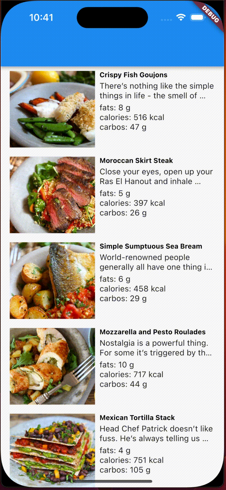

# recipe_app

Single-page application that use [recipes.json](https://hf-android-app.s3-eu-west-1.amazonaws.com/android-test/recipes.json) to show list of recipe.

This is an app that uses **bloc** as the state management system, **dio** as the networking service, **get_it** for dependency injection, and **mocktail** and **bloc_test** for testing. In addition, Recipe app flows SOLID principle.

## Flutter version

> 3.10.6

# Stacks

## State Management - BLoC

[Bloc](https://bloclibrary.dev/#/) is a state management library for building reactive applications using the [BLoC](https://www.didierboelens.com/2018/08/reactive-programming---streams---bloc/) pattern. It helps to manage the state of the app in a predictable way and makes it easier to test.

## Networking Service - Dio

[Dio](https://pub.dev/packages/dio) is a powerful HTTP client for Dart which supports Interceptors, FormData, Request Cancellation, File Downloading, Timeout etc. It provides a simple, powerful, and efficient syntax for making API requests.

## Dependency Injection - get_it

[get_it](https://pub.dev/packages/get_it) is a simple yet powerful dependency injection tool for Dart and Flutter. It helps to keep the codebase clean, decoupled, and easy to maintain.

## Testing - mocktail and bloc_test

[mocktail](https://pub.dev/packages/mocktail) is a zero-boilerplate mocking library for Dart and Flutter. It provides a simple and intuitive syntax for generating mocks and stubs.

[bloc_test](https://pub.dev/packages/bloc_test) simplifies testing BLoCs by providing functions to emit events to BLoCs and assert that the correct states are emitted.

# Testing Strategies for the Recipe App

## Cubit: RecipeCubit

**Unit Tests**

1. Test that the initial state of the RecipeCubit is correct. 

2. Test that the cubit emits the correct state when a recipe is added. 
3. Test that the cubit emits the correct state when a recipe is edited.
4. Test that the cubit emits the correct state when a recipe is deleted.
5. Test that the cubit emits an error state when an invalid action is performed. 

**Integration Tests**

1. Test that the RecipeCubit works correctly with the Repository layer
2. Test that the RecipeCubit works correctly with the View layer

## View: RecipeView

**Unit Tests**

1. Test that the view renders correctly when the RecipeState is in the initial state 
2. Test that the view updates correctly when a recipe is added or edited 
3. Test that the view updates correctly when a recipe is deleted
4. Test that the view handles errors correctly 

## Integration Tests

1. Test that the RecipeView works correctly with the RecipeCubit and RecipeState.
2. Test that the RecipeView interacts correctly with user input.

# Screens

